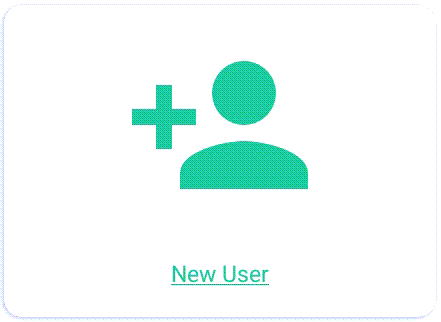

Creating a New User Profile
=======

Open the Program
-----

1.	Tap the **BTT Recorder icon** on the tablet screen. This icon may not be on the main screen; you may need to scroll to a different screen to find it, or open your apps. You can then tap and drag it to the main screen if desired.

2.  The first time you open the program, tap **ALLOW** to grant BTT Recorder access to media files, and then tap **ALLOW** to give the program permission to record audio.

Create a New User Profile
-----

1.	To create a new User profile, tap the **New User** card.

2. Read, or have someone read to you, the three Terms of Use.

*  Tap on each of the green bars.
*  Read the content. You may need to scroll to see the entire contents of the ‘Translation Guidelines’.
*  Tap on ‘Close’ at the bottom of each of the windows. 

    **Note**: Tapping on the green 'NO THANKS' link closes the program. 

3.	Tap the green I AGREE link at the bottom of the window if you agree with all three statements.

4.  Tap the Record icon (microphone) and record your name or pseudonym.  

    A pseudonym is a false name that is used instead of the real name of the person doing the work. You could use a pseudonym if you are concerned that being associated with Bible translation work would compromise your safety or that of your family.

5. You will need to record your name while the red circle is going around – 3 seconds.

6. Press the play button to listen to the recording.

If you can you hear your voice and understand your words, then tap the green Yes button.

.. image:: ../images/RecordNameYes.gif
    :width: 280 px
    :align: center
    :height: 85 px
    :alt: Accept Recording of Name

If your voice is too soft or you cannot understand your words, then tap the Redo button to make another recording.

.. image:: ../images/RecordNameRedo.gif
    :width: 275 px
    :align: center
    :height: 85 px
    :alt: Redo Recording of Name

When you accept the recording - the opening recording screen opens, and you are ready to start a new project.

**NOTE**: If you want to create another user, you can log out of the program (see `The 3-dot (Options) Menu <https://btt-recorder.readthedocs.io/en/latest/menus.html#the-3-dot-menu-on-the-project-management-screen-home-screen>`_)
