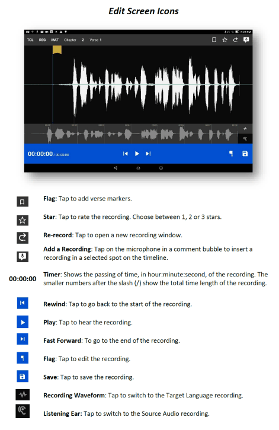

Edit screen
==================

A take is a recording of a verse or chunk; a verse/chunk can have multiple takes. Immediately after recording a take, the program automatically advances to the Edit screen. You can also navigate to the Edit screen for a completed take by tapping the Waveform icon on the Take Bar of the Verse or Chunk list. 

The edit screen enables you to edit the take of a verse or chunk in the following ways: 

*  ..//latest/edit_screen.html#compare-the-recording-to-the-source-audio
*	`Remove`_ sections of a recording.
*	`Insert`_ new sections into a recording.
*	_`Place'_ verse markers
*	`Rate`_ the recording

The Edit screen contains several icons to perform this functionality, as shown below:

.. _refname:'Compare'
Compare the recording to the source audio
^^^^^^^^^^^^^^^^^^^^^^^^^^^^^^^^^^^^^^^^^^^^^^^^

If you have source audio, you can compare the target language recording to the source audio to see what, if anything, needs to be changed in your translation. Perform the following steps:

1.	Tap the **Ear icon** to switch to Source Audio.
2.	Tap the **Play icon** on the gray bar. 
3.	To pause the recording tap the **Pause icon** on the gray bar (the Pause icon replaces the Play icon when the audio is playing.)  
4.	To rewind (go towards the beginning of the recording) or fast forward (go towards the end of the recording) tap and hold the **green dot** and slide your finger to the left for rewind or to the right to fast forward.
5.	To return to your recording, tap the **Waveform icon**.   
6.	Then, listen to the recording: 

    ``a.``	To playback your recording, tap the white **Play icon** on the blue bar. 
 
    ``b.``	To pause the playback of the recording, tap the **Pause icon** on the blue bar. (The Pause icon replaces the Play icon.)

    ``c.``	To rewind to the beginning of the recording or go to the end of the recording tap the **Rewind** or **Forward** icon. 
 
7.	Tap between the source audio (Ear icon) and target language (Waveform icon) playback to compare the entire recording.

Cutting
^^^^^^^^^^

The action of removing a section of a recording is known as a "cut". 

To make the cut you first mark the section to be deleted. There are 2 ways to mark a section.

1. The first way is to use the upper waveform window:

    ``a.``	Position the audio at the thin blue line for the beginning of the recording to be removed. **NOTE**: The blue line does not move. You need to do the tap-and-hold action to move the recording to the blue line.
 
    ``b.``	Tap the **Flag icon** to set the beginning point of the cut. This inserts a marker where the cut will start.
    
    ``c.``	Drag the recording by holding your finger on the screen and sliding to the left until the end of the part to be removed is at the blue line.
    
    ``d.``	Tap the upside-down **Flag icon**. This marks the end of the section for deletion.
   
2. The second way to mark a section for deletion is by using the entire waveform that is displayed in the lower section of the window.

    ``a.``	Tap and hold where you want the deletion to begin and drag to the end of the deletion. 
    
    ``b.``	As you do so, the marked area is shown in both the upper and lower waveform areas and the flags are inserted automatically.

**OPTIONAL**: Tap the **Play icon** to listen to the section that will be removed.

**Do you want to change the amount of recording that is selected?** Tap-hold-drag on the upside-down flag to increase or decrease the amount of the selected recording.

**Need to start again?** Tap the **Crossed-off Flags** icon to remove the flags and start at step 1.

Tap the **Scissors icon** to cut the section you have marked for deletion.

**OPTIONAL**: Tap **Play** to listen to the take to ensure it is correct. If you made a mistake, tap the **Undo icon** to restore the deleted section.

Tap the **Save icon** to save the edit. BTT Recorder saves the edited take and returns to Project Management.

Inserting
^^^^^^^^^^^

Sometimes you may want to insert a missing part into the translation. For example, to re-record a section of the take, you can first cut it and then insert the replacement for the section.

To insert a section into the recording, perform the following steps:

1.	Position the audio at the thin blue line for where the new audio will be added in (use the tap-hold-drag action, or tap in the lower waveform, or listen to the recording and tap **Pause** when you are at the correct place.)
2.	Tap the **Add a Recording** icon   in the top gray bar. This opens a new recording session for the part to be inserted. **NOTE**: The bar at the bottom of this window is green.
3.	Tap the **Microphone icon** to start recording.
4.	When finished, tap the **Pause icon**.
5.	To insert the new recording, tap the **Checkmark icon**.
6.	A pop up appears stating it is inserting recording … please wait.
7.	The original target language recording opens with the inserted recording added.
8.	To save the file tap the **Save icon**. A ‘Saving’ pop-up appears.

Once the program is done saving, the Project Management verse/chunk list screen opens with a new take added at the bottom of the take list. For example, if there were 3 takes before recording the new section, the added take is Take 4.

Placing verse markers
^^^^^^^^^^^^^^^^^^^^^

Verse markers are available only when recordings are done in chunk mode. To insert the verse markers, perform the following steps:

1.	Open the recording in the Edit screen.
2.	Tap on the bookmark icon. The Verse Marker window opens.
  *	Notice the yellow playback bar on the bottom of the window.
  *	The top gray bar has the number of markers left to put into place.
  * A verse marker is at the beginning of the recording.
3.	Locate the end of the verse:
  * Tap the **Play icon** to play back the recording.
  * Tap the **Pause icon** to stop the playback when it is at a verse ending.
  * Other ways of finding the correct spot in the recording:
      *	Use the tap-hold-drag action to move the playback forward or backward until the verse division is on the blue line.
    OR
      * Tap in the bottom waveform.
4.	To add the verse marker, tap the **white flag** on the yellow bar at the bottom right of the screen.
5.	If there is another verse to mark: Continue to listen to the playback for the next ending of a verse.
6. If you need to move a verse marker, you can use the tap-hold-drag action to move a verse marker flag forward or backward on the waveform.
7. When there are no more verse markers to place – tap the X icon at the top left of the window, just to the left of where it tells you the number of markers left to be placed.
8. The Edit screen opens and shows the verse markers. Tap the **Save icon** at the bottom right of the screen to save and return to Project Management.

**HINT**: You might want to rate this recording before saving.

Rating
^^^^^^^^

To indicate the quality of the recording, you can add a star rating to it. The star ratings are used by the program to determine which take of a verse or chunk to use when compiling an entire chapter recording (see `Creating a Chapter Recording <https://btt-recorder.readthedocs.io/en/latest/compiling.html>`_).

1.	Tap the Star icon (either on the verse/chunk bar or in the top gray bar of the edit window). The ‘Rate this take’ window opens.
2. Decide on a rating:

  * Tap the left star if the recording is not the best – the star turns red.
  * Tap the middle star if the recording is fine but could be better – the stars turn yellow.
  *	Tap the right star for an excellent recording – the starts turn green. Only one take per verse/chunk can be rated 3 stars, because this indicates the accepted take.
  
2.	Tap **OK** to save.
