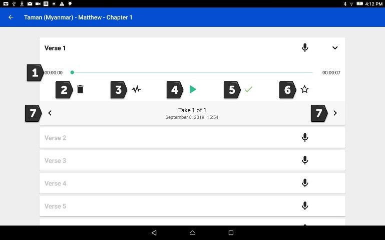

Edit Recordings in Project Management
=============

See the `"Edit Screen Icons" <https://github.com/WycliffeAssociates/btt-recorder-docs/raw/master/appendix/BTT-Recorder_Edit_Screen_Icons_v1.4.pdf>`_ document for the list of icons and their name. 

Find a recording
***** 
1. Start at the Project Management screen. Tap on a Project to edit.
2. Tap on the Chapter bar.
3. To record a new take of a verse/chunk, tap the microphone icon.
4. To see the existing takes, tap the arrow at the end of the verse bar. 

The take management bar opens. (**A 'take' is the word that refers to a recording.**) It is now possible to work with the recordings from this verse. 

Tap on the right or left arrow to go between the audio takes for a verse. Notice the take number changes.

Verse/Chunk Take Bar
*****

The items in the verse take bar are (listed top to bottom and left to right):

1. The time line of the length of the audio take. The line expands left to right as the audio take plays.

2. Garbage can icon - Tap on the garbage can icon to delete a selected take. 

    **NOTE:** The numbering of the takes changes to reflect the lower number of takes available. 

3. Waveform icon - Tap on the waveform icon to invoke the editing screen of BTT Recorder.
4. Play icon - Tap the play icon to play the recording. Tap the pause icon to stop the recording.
5. Checkmark – Indicates whether the take is approved to use. Tap to turn green. Only one take per verse/chunk can have a green checkmark. When the take is rated with 3 stars, this checkmark is green.
6. Star icon - Tap on the star icon to rate the recording.
7. Choose a recording - Tap on the right or left arrow to go between the audio takes for a verse. Notice that the take number changes.

Rate the recording:
*****
1. Tap on the star icon on the verse bar.
 * Tap on the left star if the recording is not the best – the star turns red.
 * Tap on the middle star if the recording is fine but could be better – the stars turn yellow.
 * Tap on the right star for a very good recording – the starts turn green. Only one take per verse/chunk can be rated 3 stars, because this indicates the accepted take.
2. Tap on OK to save.

Go to the next topic - `Cutting and Inserting <https://btt-recorder.readthedocs.io/en/latest/editing2.html>`_ to learn how to edit the recordings in BTT Recorder.
