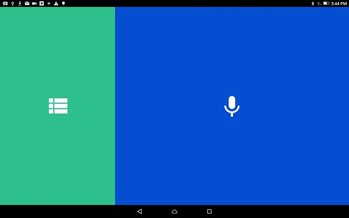
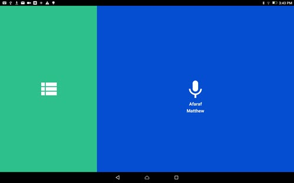

Home Screen
=============

The Home Screen is divided into two sections that appear differently depending on if you have existing projects.

On a Fresh Install
^^^^^^^^^^^^^^^^^^^^^^^^^^^^^^^^^^^^^^^ 
If you have just installed BTT Recorder, you have no existing projects. The left section of the home screen shows a list icon depicted as 3 horizontal lines, while the right section shows a microphone icon. 

To start a new project, you can do either of these two actions:

* Tap in the right section of the home screen,

* Tap in the left section to open the Project Management page,

and start a new project there.

    
Program with Existing Projects
^^^^^^^^^^^^^^^^^^^^^^^^^^^^^^^^^^^^^^^ 

If there are existing projects, the name of the last project you last worked on is displayed in the right section. You can tap into this section to continue working on that project.

    
Open Another Project
-------
Tap in the left section of the home screen, the project management screen is displayed. This page lists all of your projects. You can tap one of them to work on it.

Create a New Project
-----
Tap in the left section of the home screen, the project management screen is displayed. This page lists all of your projects. You can tap the Plus icon, located at the bottom right of the screen, to start a new project.
 
