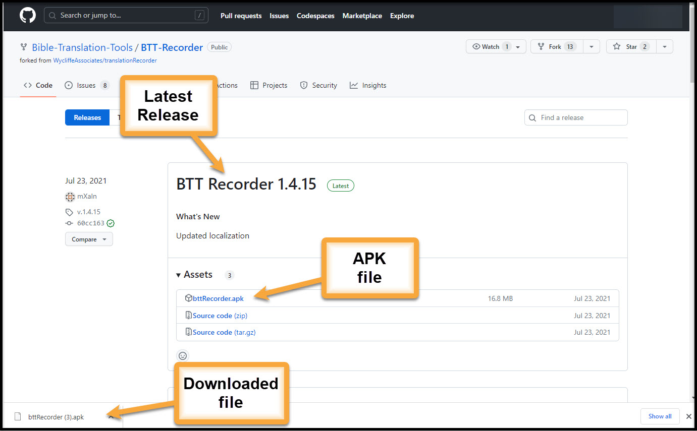

Installing the BTT Recorder Program
=======

1.	Go to this URL: https://github.com/Bible-Translation-Tools/BTT-Recorder/releases.
2.	The latest release is listed first.  The list of files that can be downloaded are in the same box under the Assets title.
3.	Tap the bttRecorder.apk link.
4.	The APK file downloads.
5.	Navigate to the download folder.
6.	Tap the bttRecorder.apk file and allow the program to install. (You may need to give permission for an APK to install on the device.)

Benefits to using the downloaded APK
----------------------------------------------
*  If you download the APK file to a USB drive, you can easily transfer the application to multiple devices without internet.
*  You can pick a specific version of BTT Recorder, including the most up-to-date version of the program.

Open the Program
=======

1.	Tap the BTT Recorder icon on the tablet screen. 

2.	The first time you open the program, tap ALLOW to grant BTT Recorder access to media files.
3.	Then tap ALLOW to give the program permission to record audio.     

