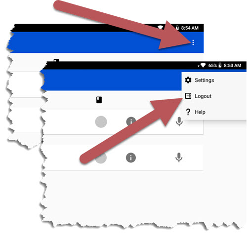

Create a New User
=======================

When BTT Recorder first opens, it displays the Available Users. If you have already created a user, tap the card that shows your identicon.

To create a new User profile

1. Tap the **New User** card.
 
2. Read, or have someone read to you, the three Terms of Use.

   * Tap each of the green bars.

     Read the content. You may need to scroll to see the entire contents of the ‘Translation Guidelines’.

   * Tap **Close** at the bottom of each of the windows. 

3. Tap **I AGREE** at the bottom of the window if you agree with all three statements.

4. Tap the **Microphone icon** and record your name or pseudonym. A pseudonym is a false name that you can use if you are concerned that being associated with Bible translation will compromise your safety or that of your family.

5. Record your name while the red circle is going around – 3 seconds.

6. Note the image in the center of the window. This is your identicon. Each user has a unique identicon. If you need to log into BTT Recorder again, you can tap the card with this identicon on the Available Users page. 

.. image:: ../images/new_identicon.jpg
    :width: 500px
    :align: center
    :height: 313px
    :alt: New User Identicon

7. Press the play button to listen to the recording.

  *	If you can you hear your voice and understand your words, then tap **Yes**.

  *	If your voice is too soft or you cannot understand your words, then tap **Redo** to make another recording.

8. When you accept the recording, the initial screen (home screen) opens and you are ready to get started.

**NOTE**: If you want to create another user, you need to log out of the program. 

1. Go to the Project Management screen.

2. Tap on the 3-dot icon at the top right to open the Options Menu.

3. Tap on **Logout**.

The sign-in screen opens.

