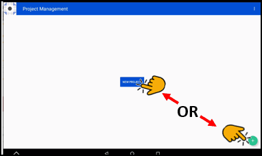

Create a New Project
---------------------------

If you have no existing projects, you will need to create a project before you can work in BTT Recorder to perform oral translation.

You can start creating a new project by one of the following methods:

*	If no project is shown in the right blue section of the Home screen, by tapping the right area (recording section) on the Home screen

*	From the Project Management screen, by tapping the **New Project button** (seen only on a new install) or the **Plus icon**. (You can get to the Project Management screen from the Home screen by tapping in the left green area.)

Once you have initiated the project, the steps to define it are the same:

1.	Select a target language

2.	Select the project type

3.	Select the mode of the recording

4.	Optionally select a source audio

**NOTE**: During these next steps, you may tap the **back arrow** in the top blue bar to go back to the previous screen at any time. You may want to go to the previous screen to make a different choice.

Step 1: Select a Target Language
^^^^^^^^^^^^^^^^^^^^^^^^^^^^^^^^

The Target Language is the language into which you will translate.

You can search for your desired language by one of the following methods:

*	Swiping from the bottom of the screen up to scroll through the languages. 

OR

*	Tapping the **Magnifying glass**. The keyboard appears. 

*	Type in the language or language code. Close the keyboard by tapping the **down arrow icon**, or **back arrow icon**.

Tap the name of the desired Target Language. The program advances to the next step.

Step 2: Select a Project Type
^^^^^^^^^^^^^^^^^^^^^^^^^^^^^^^^

The Project type defines what you will be translating from and consists of:

a)	What kind of project? Tap to select from the choices of **Bible: Old Testament**, **Bible: New Testament**, or **Open Bible Stories**.

b)	Which book or story? Tap a book in the Bible or a Bible story to translate. Swipe up to see more book or story names.

c)	If you are translating the Bible, which translation type? If you are translating from the UDB or ULB, tap one of those choices. Otherwise, tap **REG: Regular**.

    **Note**: This choice does not apply to Open Bible Stories.

Step 3: Select the Recording Mode
^^^^^^^^^^^^^^^^^^^^^^^^^^^^^^^^^

**Note**: This choice does not apply to Open Bible Stories.

This defines whether you will record a verse at a time or a chunk at a time. In most cases, you should record in verse mode. 

* Verse mode has each recording separated like a regular Bible, one verse at a time.
 
* Chunk mode has each recording separated according to groups of verses. 

**Important**: If you are using source audio, the mode that you select should match that of the source audio.

Step 4: Select the Source Audio (optional)
^^^^^^^^^^^^^^^^^^^^^^^^^^^^^^^^^^^^^^^^^^

If you do not have source audio available, tap **SKIP** in the lower right corner of the screen.

* If you do have source audio, you must specify the language and the location of the audio file. Go to `Importing Source Audio <https://btt-recorder.readthedocs.io/en/latest/sourcefile.html>`_ for complete instructions.

The Recording screen opens. You are now ready to record. Go to `Recording screen <https://btt-recorder.readthedocs.io/en/latest/recordingscreen.html>`_ for instructions on how to record. 
