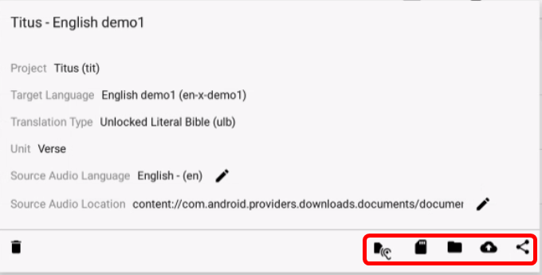
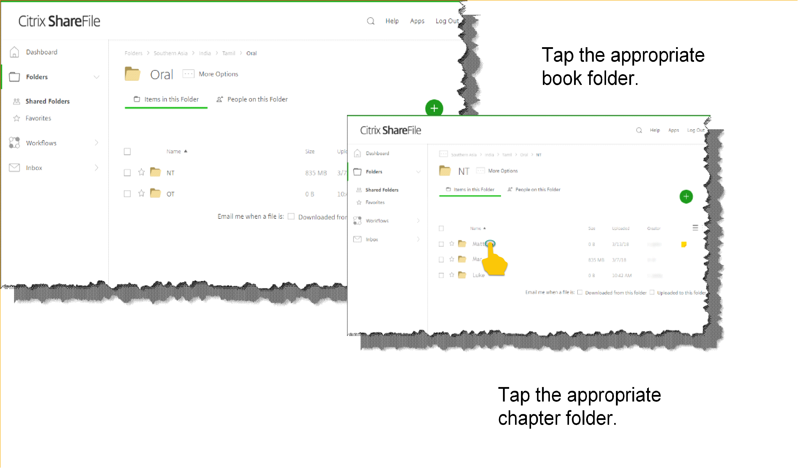

Sharing Your Recordings
=======================

After the recordings have been made, edited, and reviewed, they are ready to be exported or uploaded so that others can share them. You can:

*	Export the completed project to your tablet as a tr file

*	Export the completed audio to your tablet as a zip file

*	Export the completed audio to another application on your tablet as a zip file

*	Upload a project to a Translation Exchange server 

*	Upload a project to the Citrix ShareFile Server

Opening the Information window
------------------------------

You can share your recordings from the Information window of the project. To open the Information window:

1.	On the Project Manager screen, tap the **Information icon** (gray circle with an "i" in it) next to the project that you want to export or upload. 
 
2.	The Information window opens. The icons along the bottom right of the window enable you to share your recordings. These icons are explained in the next few paragraphs.
 

Export Recordings
-----------------

Export to your tablet as a tr file 
^^^^^^^^^^^^^^^^^^^^^^^^^^^^^^^^^^

This action exports the project as a tr file to your tablet. You can give this file to others to import into their installation of BTT Recorder so that they can work on it, or you can use it as a source audio file for BTT Recorder.

To create a tr file on your tablet, perform the following steps:

1.	On the Information window, tap the **Source Audio icon** (listening ear) to save the tr file to the tablet’s file system.
 
2.	A file manager window opens to enable you to navigate to and open the folder where you want to save the tr file. You can save it anywhere in your internal storage or to your SD card. You can also rename the file before saving it if desired. **NOTE**: The SD Card may need to be “activated.” Follow the directions provided by the tablet on activating the SD Card so that you can save files there.

3.	Tap **SAVE** to save the file. If you save it to the SD Card, you can remove the card to share the file with others. 
 
Export to your tablet as a zip file
^^^^^^^^^^^^^^^^^^^^^^^^^^^^^^^^^^^

This action packages the individual wav files into a single zip file that you can save to your tablet. You can give this file to others or you can import it into Orature software. 

1.	On the Information window, tap either the **Save icon** or the **Folder icon** to save the project file to the tablet’s file system.

2.	Wait while the files are processed. The program compiles a zip file containing the individual wav files for each chapter.
 
3.	A file manager window opens to enable you to navigate to and open the folder where you want to save the zip file. You can save it anywhere to your SD card or in your internal storage. You can also rename the file before saving it if desired. **NOTE**: The SD Card may need to be “activated.” Follow the directions provided by the tablet on activating the SD Card so that you can save files there.

4.	Tap **SAVE** to save the file. If you save it to the SD Card, you can remove the card to share the file with others.

Export the file to another application
^^^^^^^^^^^^^^^^^^^^^^^^^^^^^^^^^^^^^^^^

To export the file and have another application immediately use it, such as in an email as an attachment, perform the following steps:

1.	On the Information window, tap the **Share icon** (3 dots with lines between) to send the project file to another of the tablet’s applications.

2.	Wait while the files are processed. The program compiles a zip file containing the individual wav files for each chapter.
 
3.	A window opens to show the available applications on your tablet that you can use for sharing. Tap the one you wish to open, such as Gmail.
 
4.	The chosen application opens – for example, Gmail opens a compose window with a zip file of the project audio already attached so that you can easily send it to someone.
 

Upload Recordings
-----------------

Upload to Translation Exchange
^^^^^^^^^^^^^^^^^^^^^^^^^^^^^^

Translation Exchange is a storage and checking program for audio files. If you have access to a Translation Exchange server, you can upload to it directly by completing the following steps:

1.	On the Information window, tap the **Upload icon** (cloud with an up arrow) to upload the project file to the Translation Exchange server.
    **NOTE**: This is the server defined in the Upload Server setting. See `Settings window <https://btt-recorder.readthedocs.io/en/latest/mainscreens.html#settings-window>`_.
 
2.	The program generates and uploads the file to Translation Exchange.
 
3.	The file has been uploaded. Optionally, you can open Translation Exchange to see that it is there. 
 
Upload to the Citrix Server
^^^^^^^^^^^^^^^^^^^^^^^^^^^

This final method of sharing your recordings does not use the Information window. You must have a ShareFile account on the Citrix server to be able to store files there.

In a browser on the tablet that has the BTT Recorder files, open the ShareFile server (https://digitalstorage.sharefile.com) using your login and password.

To upload to the Citrix server, you perform the following steps:

1.	Find the folder for the files on the Citrix server

2.	Create the Bible book folder

3.	Create chapter folders

4.	Upload chapter recordings to the chapter folders

**Find the folder for the files on the Citrix server**

1.	Tap the folder for target language of your project. The folders are shown under the region and/or country of the language. You can first tap the **Magnifying glass icon** to search for the target language if desired. For example, if the target language of your project is Chickasaw, tap the Magnifying glass icon and type “Chickasaw” in the search box, and then tap Sea 

2.	The search results are returned. It shows that the Chickasaw folder is found in the Americas/United States folder. Tap the Chickasaw folder to open it.
    **Hint**: If you will be using that folder frequently, you can tap the star next to it to mark it as one of your favorites.
 
3)	The Chickasaw folder is empty, so you need to create a folder structure to store the files. Instructions for that in the next section entitled "Create the folder structure". However, if you are in a folder that has the folder structure already set up, tap the **Oral folder** in the language that you are recording. The example below shows the structure of the Tamil language folder.         
             
4)	Tap the appropriate testament folder – OT for an Old Testament book, or NT for a New Testament book.
 

**Create the folder structure**

If the folder structure for the language does not exist, you need to create it. 

1.	Tap the language folder to open it.

2.	Tap the **Plus icon**.

3.	Tap **Create Folder** on the menu.

4.	Tap in the Name field and type **Oral**, and then tap **Create Folder**.
 
5.	In the Oral folder, create the testament folder (OT or NT).

6.	In the testament folder, create a folder for the book of the Bible. You should name it with a leading identification number

7.	Tap in the Name field and type the book name with the leading identification number. You may use the language’s name for the folder if the identifying number is there (such as 42-Markos for Spanish).
 
    (see table entitled “Global Standard Nomenclature for Books in the Bible”  below – 2-digit number and 3-letter. For example, the 2nd New Testament book for the Spanish Bible would be 42-MRK (or 42-Markos if you use the Spanish name with the leading identification code).

8.	Tap **Create Folder**. The new folder is created and opened. 

9.	Create Chapter folders – one for each chapter in the book. To create a new chapter folder:    

    a) In the Bible book folder, tap the **Plus icon**.

    b)	Tap **Create Folder** in the menu.

    c) Tap in the ‘Name’ field and enter the chapter number as 2 digits, with a leading zero for single-digit numbers.
    
    d) Tap the blue **Create Folder** button. The new folder is created and opened.
 
    e) To return to the book folder to create another chapter folder, tap the book name in the top breadcrumbs.
 
    ``*`` Repeat steps a) through e) to create a folder for each chapter.

.. list-table:: **Global Standard Nomenclature for Books in the Bible**
   :widths: 30 30 30 30 30 30 30
   :header-rows: 0

   * - 01-GEN	
     - 11-1KI	
     - 21-ECC	
     - 31-OBA	
     - 41-MAT	
     - 51-PHP	
     - 61-1PE

   * - 02-EXO	
     - 12-2KI	
     - 22-SNG	
     - 32-JON	
     - 42-MRK	
     - 52-COL	
     - 62-2PE
     
   * - 03-LEV	
     - 13-1CH	
     - 23-ISA	
     - 33-MIC	
     - 43-LUK	
     - 53-1TH	
     - 63-1JN

   * - 04-NUM
     - 14-2CH	
     - 24-JER	
     - 34-NAM	
     - 44-JHN	
     - 54-2TH	
     - 64-2JN

   * - 05-DEU	
     - 15-EZR	
     - 25-LAM	
     - 35-HAB	
     - 45-ACT	
     - 55-1TI	
     - 65-3JN

   * - 06-JOS	
     - 16-NEH	
     - 26-EZK	
     - 36-ZEP	
     - 46-ROM	
     - 56-2TI	
     - 66-JUD

   * - 07-JDG	
     - 17-EST	
     - 27-DAN	
     - 37-HAG	
     - 47-1CO	
     - 57-TIT	
     - 67-REV
        
   * - 08-RUT	
     - 18-JOB	
     - 28-HOS	
     - 38-ZEC	
     - 48-2CO	
     - 58-PHM
     - 

   * - 09-1SA	
     - 19-PSA	
     - 29-JOL	
     - 39-MAL	
     - 49-GAL	
     - 59-HEB	
     - 

   * - 10-2SA	
     - 20-PRO	
     - 30-AMO	
     - ``*``     
     - 50-EPH	
     - 60-JAS	
     -

``*``The number 40 is skipped

Now that you have the folders set up, you can upload your recordings to them. Translators typically upload from their tablets; however, a MAST technical support person may harvest the audio files from a tablet to a thumb drive and then use the computer to upload them. Both methods are discussed below.

**Upload chapter recordings from the tablet**

1.	Navigate to the correct language, book and chapter folder. If they are not present – see the instructions to create the folder structure.

2.	Tap the chapter folder.
 
3.	Tap the **Plus icon**. 

4.	Tap **Upload** on the menu. 
 
5.	The Upload window opens. Tap **Browse files**.

6.	A file manager window opens. Tap in turn the following folders:

    * On the left section, tap **Internal Storage**.
 
    * On the right section:
    
      * Tap **BTTRecorder**.
 
      * Tap your target language code.
 
      * Tap the project type.
 
      * Tap the book code.
 
      * Tap the chapter number. 
 
  * The chapter folder opens and shows all the verse recordings for that chapter. Do a long tap on one of the files (tap and hold until the file’s bar turns darker), and then tap each of the other files to select all of them

  * Tap **OPEN** at the top right of the screen.
 
  * The list of files appears in the ShareFile window. Tap **Upload** to upload the files.
    **Note**: This screen may not appear – it may upload the files automatically.
 
  * It may take some time to upload the files.
 
 **Upload chapter recordings from the computer**

These steps assume that a MAST Tech Support Person, or someone working on the recordings, has harvested the files from the tablets onto a thumb drive.

In a browser on the computer that has the BTT Recorder files, open the ShareFile server (https://digitalstorage.sharefile.com) using your login and password.

Follow these steps to add files to a folder on the ShareFile server:

1.	Navigate to the correct Language, Book and Chapter folder.

2.	Tap the Chapter folder to open it.

3.	Tap the **Plus icon**. 

4.	Tap **Upload** on the menu. 
    The Upload window opens. There are 2 ways to upload the files:

    * Browse to files:
    
      *	Click **Browse files**.
      
      *	Use the File Explorer to browse to the files on the thumb drive or computer’s hard drive.
      
      * Select the desired files and click **Open**.
      
      * On the Upload window on ShareFile, click **Upload**. Wait while the files upload to the server.

OR

    * Drag the files from the File Explorer.

      * Open File Explorer and browse to the files on the thumb drive or computer’s hard drive.

      * Select the files and click-hold-and-drag the files to the browser window. Release the mouse button when you see the words “Drop files here”. 
 
      * Wait while the files upload to the server.

  Repeat these steps for all audio files in each of the chapters. 
